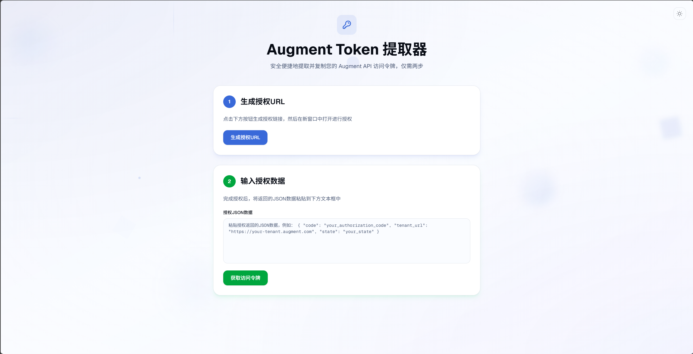
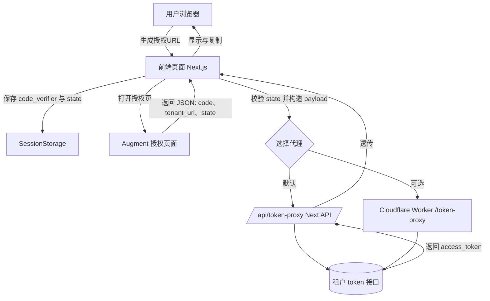
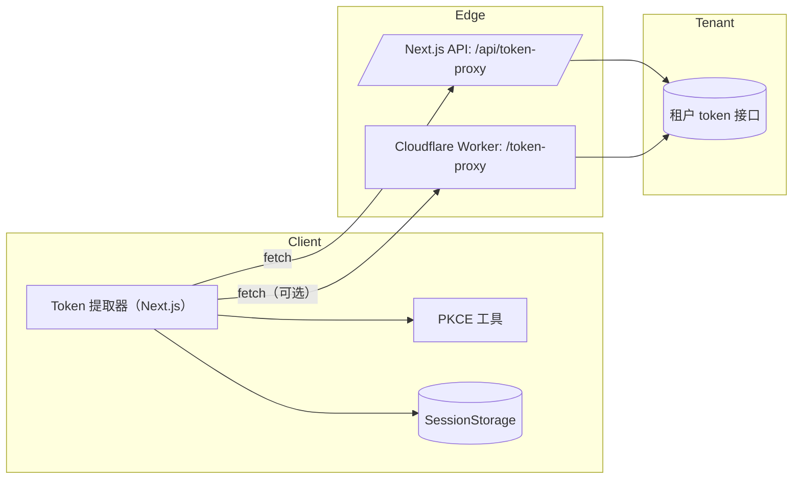

<div align="center">

<h1>🔐 Augment Token 提取器</h1>


<p>一个极简、可离线运行的 Augment API Token 提取工具。支持一键生成授权 URL、粘贴授权 JSON 后获取访问令牌，并可复制令牌与租户 URL。内置 ACE 微交互与浅/暗主题切换。🚀✨</p>

<p>
<a href="https://github.com/Sube3494/Augment-Token-Extractor/actions/workflows/ci.yml"></a>
<a href="LICENSE"></a>
<a href="https://conventionalcommits.org"></a>

</p>

<p>


</p>

</div>

### 预览截图 📸



## 功能特性 ✨
- 授权 URL 生成（PKCE）
- 粘贴授权返回 JSON，交换访问令牌
- 一键复制：授权 URL、访问令牌、租户 URL
- 底部居中 Toast 提示（带进入动画）
- 主题切换（浅色/暗色，跟随系统，持久化）
- 无第三方 UI 依赖，KISS/YAGNI

## 快速开始 🚀
### 环境要求
- Node.js 18+（推荐 20）
- pnpm

### 本地运行
```bash
pnpm install
pnpm dev
```
打开 http://localhost:3000

### 使用流程（可视化）
下图展示从生成授权链接到获取访问令牌的完整流程。



1) 点击“生成授权URL”，在新窗口完成授权
2) 将返回的 JSON 粘贴到“授权JSON数据”输入框
3) 点击“获取访问令牌”，复制“访问令牌”和“租户URL”
4) 右上角可切换浅色/暗色主题

## Token 代理（Next.js API）
前端通过 /api/token-proxy 代理到租户的 /token 接口：
- 允许来源：ALLOWED_ORIGINS（默认 *）
- 租户 URL 白名单：TENANT_URL_WHITELIST（可选，逗号分隔）
- 校验：tenant_url 必须以 https:// 开头并以 / 结尾

本地示例（.env.local）：
```
ALLOWED_ORIGINS=*
TENANT_URL_WHITELIST=https://d10.api.augmentcode.com/,https://d18.api.augmentcode.com/
```

手动调用示例：
```bash
curl -X POST http://localhost:3000/api/token-proxy \
  -H "content-type: application/json" \
  -d '{
    "tenant_url": "https://d10.api.augmentcode.com/",
    "payload": {
      "grant_type": "authorization_code",
      "client_id": "<your_client_id>",
      "code_verifier": "<saved_code_verifier>",
      "redirect_uri": "",
      "code": "<authorization_code>"
    }
  }'
```

## 项目结构（核心）
- src/app/page.tsx    页面与交互逻辑
- src/app/layout.tsx  全局布局（主题 Provider、字体）
- src/app/globals.css 全局样式（ACE 动效与动画）
- src/lib/pkce.ts     PKCE 工具
- src/app/api/token-proxy/route.ts Next API 路由
- docs/images         文档图片（将你的截图放到这里）

## 系统架构 🧩
下图展示了前端、边缘代理（Next.js API 或 Cloudflare Worker）与租户 Token 接口的通信关系：



## 常用脚本 🛠️
```bash
pnpm dev     # 本地开发
pnpm build   # 生产构建
pnpm start   # 启动生产构建产物
pnpm lint    # 运行 ESLint（可选）
```

## 部署 🚢

### 一键部署网站（Vercel） ▶️

[](https://vercel.com/new/clone?repository-url=https%3A%2F%2Fgithub.com%2FSube3494%2FAugment-Token-Extractor&project-name=augment-token-extractor&repository-name=Augment-Token-Extractor&install-command=pnpm%20install%20--frozen-lockfile&build-command=pnpm%20build&env=ALLOWED_ORIGINS,TENANT_URL_WHITELIST&output-directory=.next)

1) 打开上方按钮，一键导入项目
2) 安装命令选择 pnpm，构建命令为 pnpm build，输出目录 .next（默认已填）
3) 部署完成后，在 Project → Settings → Environment Variables 手动添加：
   - ALLOWED_ORIGINS：你的前端域名（生产环境不要用 *）
   - TENANT_URL_WHITELIST：允许的租户前缀（逗号分隔，以 / 结尾）
4) 本地变量写在 .env.local，Vercel 会在构建时自动注入项目环境变量
5) 如果使用 GitHub Actions 的 deploy.yml 做“预构建后部署”，需要在仓库 Secrets 中配置：
   - VERCEL_TOKEN：Vercel API Token（Vercel → Account → Tokens）
   - VERCEL_ORG_ID：项目所属 Org ID
   - VERCEL_PROJECT_ID：项目 ID

### 一键部署中转站（Cloudflare Worker，可选） ☁️

[](https://deploy.workers.cloudflare.com/?url=https%3A%2F%2Fgithub.com%2FSube3494%2FAugment-Token-Extractor)

1) 打开上方按钮，进入 Cloudflare 控制台完成导入
2) 在 Variables 中设置：
   - ALLOWED_ORIGINS：允许的前端域名（多个用逗号）
   - TENANT_URL_WHITELIST：允许的租户前缀（逗号分隔，以 / 结尾）
3) 若本地/CI 用 wrangler 部署：
   - 安装：pnpm dlx wrangler --version（已内置）
   - 配置 wrangler.toml（仓库已提供）
   - 部署：pnpm dlx wrangler deploy --config wrangler.toml
   - 在 CI（GitHub Actions）中需要 Secrets：CLOUDFLARE_API_TOKEN、CLOUDFLARE_ACCOUNT_ID
4) 入口文件：workers/token-proxy.ts（已提供 wrangler.toml）

> 本项目提供两种“令牌交换中转站”：Vercel 的 Next.js API（默认随网站部署），或 Cloudflare Worker（独立部署）。选择其一即可。


## 技术与约定 📚
- Next.js 15（App Router）
- Tailwind CSS v4（@tailwindcss/postcss）
- 路径别名：@/* → src/*（见 tsconfig.json）
- 主题：next-themes（系统/浅色/暗色）
- ACE：.ace-press / .ace-ripple 微交互工具类

## 安全与隐私 🔒
- 访问令牌属于敏感数据，请勿提交到仓库或暴露在截图/日志中
- 若误泄露，请立即在服务端吊销并重新生成


## 许可证 📄
本项目基于 MIT 协议开源，详见 LICENSE 文件。
